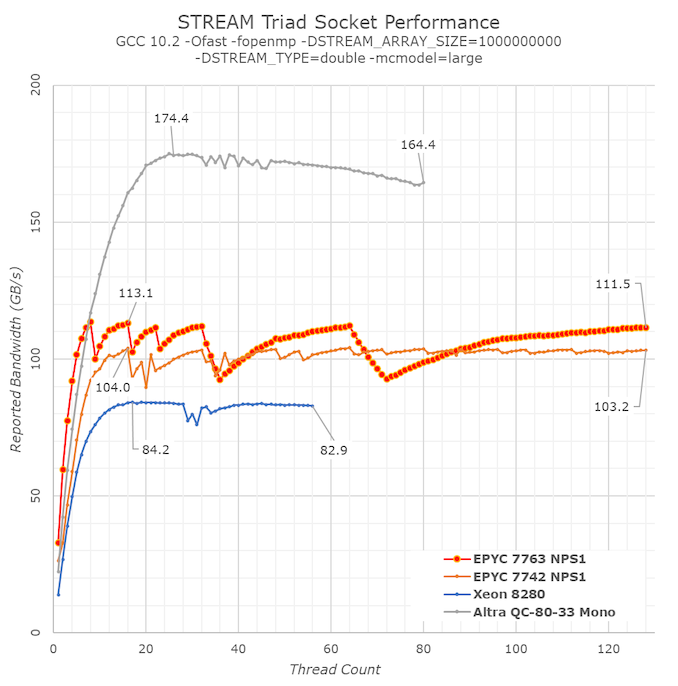

## Memory Bandwidth

    AMD在STREAM-Triad测量的带宽，相比上一代7002，提升了3-5%。
    选择使用GCC10.2编译STREAM，避免显示使用non-termporal memory access， 因为我认为这些不符合现实中的实际负载行为。其中原因在AmpereAltra文章中有详细解释（https://www.anandtech.com/show/16315/the-ampere-altra-review/3）

    此外，我没有只看单一的测试结果数据，而是绘制从 1 thread/core扩展到整个 128 线程系统时的带宽曲线图。
    如果仅看带宽的峰值，可见Milan比Rome架构芯片高出8%，略高于AMD市场部门的预测。AMD未指明这些是NPS1还是NPS4，but we prefer using STREAM to measure bandwidth within a single memory node – scaling up to multiple nodes should normally be expected to simply be a multiple of the node。
    真正有趣的是Milan在核数较少时BW变化的行为，可以看到新的7763和其他竞争对手比，遥遥领先，并且Milan在8个core时就能到达BW峰值，而Roma则需要16个core， The cause of these excellent results is likely the much-improved load/store capabilities of the new Zen3 cores。
    What’s odd here in the bandwidth curve, is the zig-zag pattern, with bandwidth sometimes regresses below earlier achieved peak figures. We’re placing threads with OMP_PLACES="cores" and OMP_PROC_BIND="spread", however this might still not be optimal in terms of spreading load symmetrically across all CCDs in the system.

ref：https://www.anandtech.com/show/16529/amd-epyc-milan-review/4
