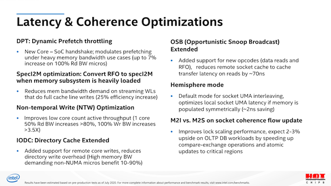

# Memory Bandwidth

Generally, what we were expecting with Ice Lake SP were figures that were +45% ahead of Cascade Lake SP, thanks to the improved memory controllers and more memory channels. Instead, what we’re seeing here are improvements reaching up to +86%, well beyond the figures we were expecting.

As per the data, the new ICX design appears to be vastly outperforming its predecessor, and also essentially leaving AMD trailing far behind in terms of raw memory performance, only falling behind Ampere’s Altra which is able to dynamically detect streaming memory workloads and transform memory operations into non-temporal ones.

What’s also to be noted is that the per-core bandwidth this generation doesn’t seem to have improved very much from Cascade Lake SP, with AMD’s newest Milan still vastly outperforming Ice Lake SP at lower thread counts, and single-core bandwidth being much higher on the competitor systems.

Inspecting Intel’s prior disclosures about Ice Lake SP in last year’s HotChips presentations, one point sticks out, and that is the “SpecI2M optimisation”, where the system is able to convert traditional RFO (Read for ownership) memory operations into another mechanism.

ref:https://www.anandtech.com/show/16594/intel-3rd-gen-xeon-scalable-review/4