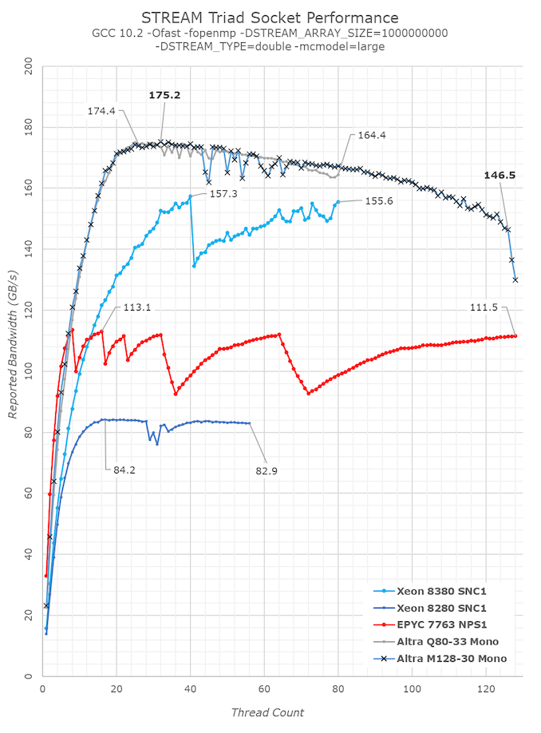
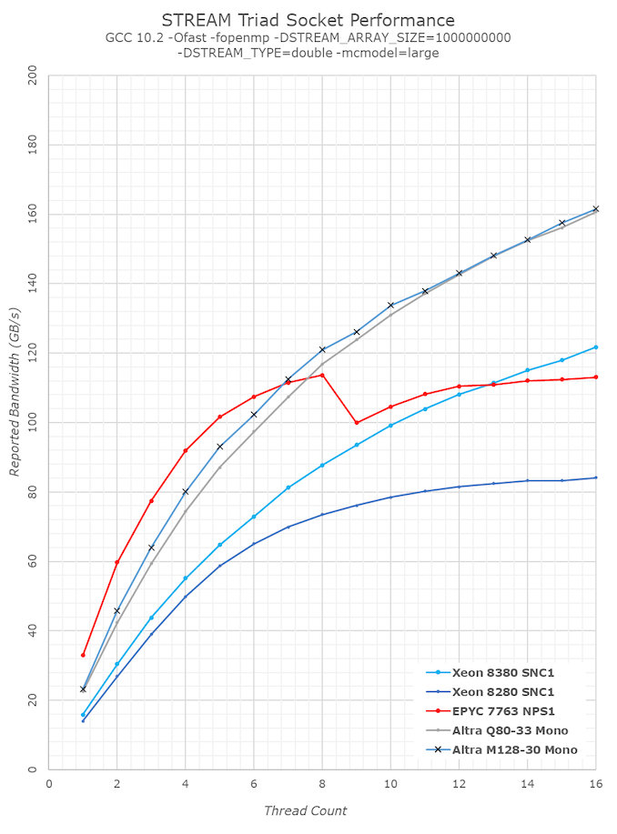

# 128 Cores Mesh Setup & Memory Subsystem

	DRAM方面，Altra和AMD的EPYC Rome或者Milan, 或者Intel的最新IceLake-SP,账面上看几乎没有差异，都是基于8-channel的DDR4-3200。Ampere先进之处在于，能够够检测到实际应用的流式内存操作，并且自动的将这些操作转化成no-temporal write。避免传统RFO导致的额外的内存read操作。Intel的Ice Lake-SP的设计类似优化设计，尽管在同一个cacheline上做了很多工作，但是和ARM相比，貌似没有释放更多的bandwidth比例。AMD当前缺少类似的优化设计，并且软件上必须显示的表明使用no-temporalwrite,才能完全充分发挥memorysubsystem的最大效能，不像Ampere和Intel那样，能够在在通用的workload上的优化效果。

    对比Q80-33和M128-30，可看到bandwidth曲线在大多数核数时重合。最新的M128-30核数增加至128，但是总bandwidth优于SoC上的资源竞争，也开始降低，这一点非常重要，在下一页展示的workload将有更加详细的说明。

在核数较少时，可以看到M128-30的BW超过Q80-33，尽管core的主频不占优势，这个现象最大的可能是由于mesh工作评率提升了11%导致。AMD的EPYC Milan在核数较少时，依旧获得在较高的BW-per-core。

ref : https://www.anandtech.com/show/16979/the-ampere-altra-max-review-pushing-it-to-128-cores-per-socket/3
